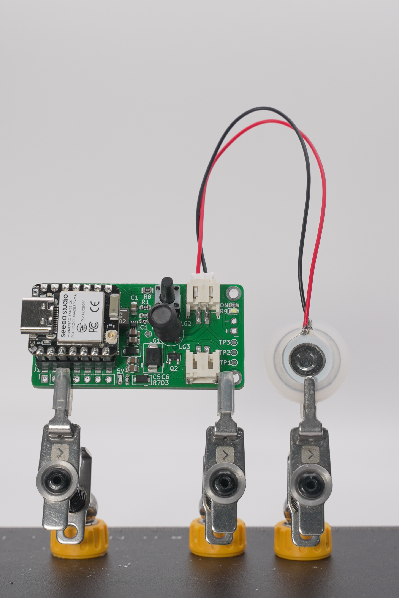

#Programmable Mist Maker

**Created by Shuang Cai & David Yang**

This open-source ultrasonic mist maker project transforms recycled containers and a custom PCB into a small-form-factor mist device. It is a fully documented, low-cost circuit with accessible explanations of misting mechanics, design challenges, and power needs.

Full Documentation on Notion: [Mist Maker Documentation](https://dav1dyang.notion.site/programmable-mist-maker)

## Overview

This project explain ultrasonic mist maker designs and provides:

* A tested, open-source reference circuit
* Lessons learned through prototyping and debugging
* A replicable and modifiable electronics system

Most mist circuits online lack documentation—this guide fills that gap with working examples and full KiCad/Arduino files.

## How It Works

Mist generation involves:

* **Ultrasonic Vibration**: A piezo disc (108.7 kHz) oscillates rapidly to turn water into mist.
* **Voltage Boosting**: A 3-legged inductor (auto-transformer) amplifies 5V input to approximately 30–40 Vpp.
* **PWM Switching**: An ESP32-C6 sends a 108.7 kHz PWM signal to a MOSFET.
* **Power Supply**: TPS61023 provides stable 5V from LiPo or USB input.

More details: [Notion Documentation](https://www.notion.so/your-notion-link-placeholder)

## Key Components

| Component                  | Function                            |
| -------------------------- | ----------------------------------- |
| Piezo Disc (108.7 kHz)     | Vibrates water to generate mist     |
| Tapped Inductor (3-legged) | Boosts voltage through LC resonance |
| AO3400A MOSFET             | Switches circuit at high frequency  |
| TPS61023 Boost Converter   | Powers piezo from battery or USB    |
| MCP73831                   | LiPo charging and protection        |
| Xiao ESP32-C6              | Controls mist and PWM               |

## Circuit Operation

1. Boost 3.3V/USB to 5V
2. ESP32 outputs PWM (108.7 kHz)
3. MOSFET switches inductor-piezo loop
4. LC resonance boosts voltage
5. Piezo emits mist

## Known Issues & Fixes

| Issue                 | Fix                                                        |
| --------------------- | ---------------------------------------------------------- |
| Mist fails on battery | Bypass Xiao's 3.3V regulator with external boost converter |
| Uploading code fails  | Add pull-down to MOSFET gate; disable boost during upload  |
| Startup delay         | Disable OTA; add delay before activating mist              |

## Assembly Instructions

**Materials:**

* PCB (v1.4)
* Piezo disc
* 3-legged inductor
* Xiao ESP32-C6
* Soldering tools
* Battery or USB-C cable
* Recycled container

**Steps:**

1. Solder all components
2. Connect piezo and inductor
3. Attach battery or USB
4. Upload firmware via Arduino
5. Seal in container (keep electronics dry)
6. Power on and activate mist

## Code & Firmware

* GitHub Repository: Coming Soon

**Example Sketches:**

* `mist_blink.ino`: Basic test
* `mist_iot.ino`: Zigbee/WiFi mist control (in development)

## Files & Downloads

* KiCad Files (.SCH, .BRD)
* STL/STEP Enclosure
* Bill of Materials (BOM)
* Workshop Slides
* Assembly Guide (PDF)

## References

* TPS61023 Datasheet – Texas Instruments
* MCP73831 Datasheet – Microchip
* GreatScott! Ultrasonic Mist Explanation (YouTube)
* BigCliveDotCom Mist Maker Teardown (YouTube)

Full reference list in: [Notion Documentation](https://dav1dyang.notion.site/programmable-mist-maker)

## Documentation Notes

This README and technical documentation were written with the support of ChatGPT (GPT-4o) to:

* Summarize logs and prototyping notes
* Clarify complex circuit behavior
* Reformat documentation for accessibility

All technical data was reviewed and validated against physical test results and datasheets.

## License & Attribution

Open-source under MIT License. Designed and tested by Shuang Cai and David Yang.

Inspired by community reverse-engineering, YouTube teardowns, and a desire to share back with the open hardware world.
