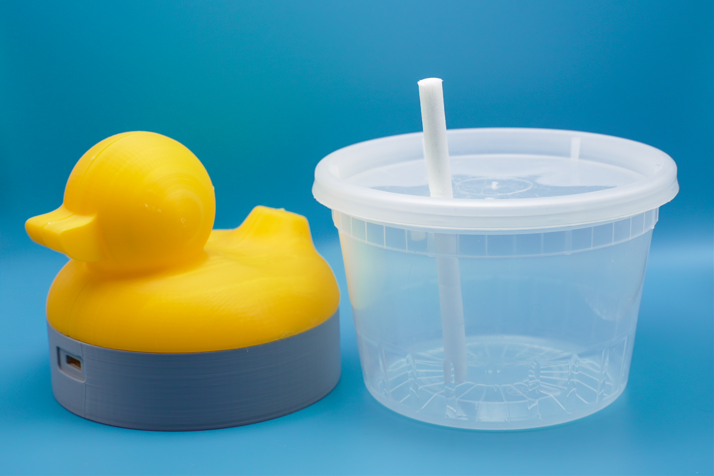
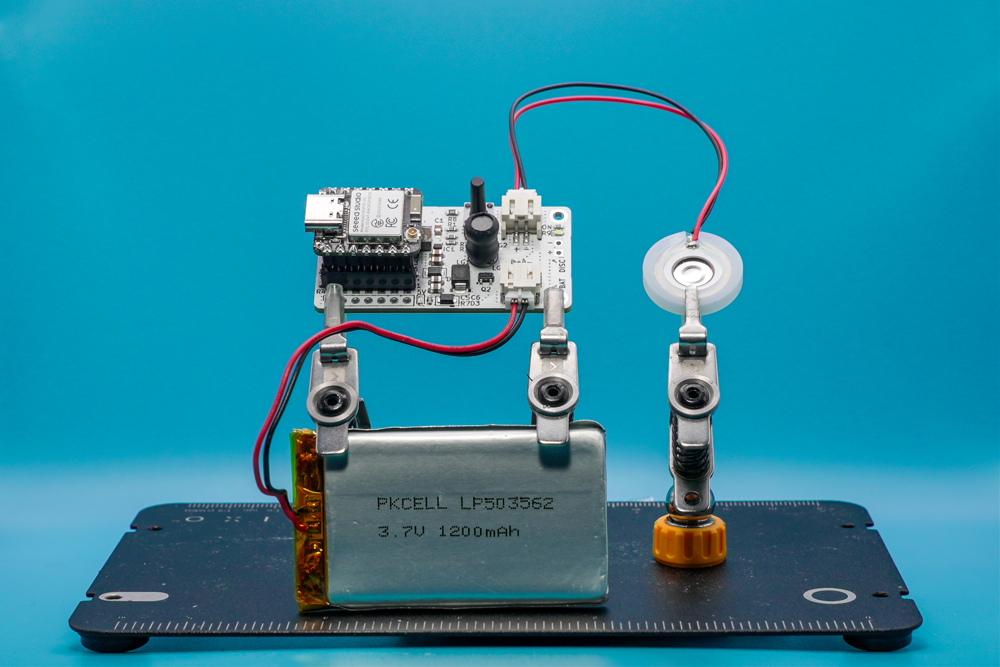
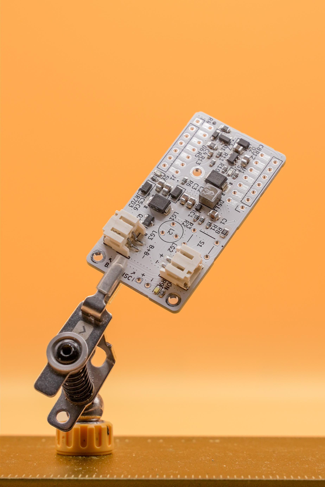

# Programmable Mist Maker V1

**Created by shuang cai & David Yang**

This [Open Source Hardware Certified](https://certification.oshwa.org/us002742.html) ultrasonic mist maker project transforms recycled containers and a custom PCB into a small-form-factor mist device. It is a fully documented, low-cost circuit with accessible explanations of misting mechanics, design challenges, and power needs.

[Full Documentation Site](https://dav1dyang.github.io/Programmable-Mist-Maker/)

[Full Documentation on Hackster.io](https://www.hackster.io/dav1dyang/waste-into-wonder-making-programmable-mist-makers-fe3ae7)

## Overview

This project explain ultrasonic mist maker designs and provides:

* A tested, open-source reference circuit
* Lessons learned through prototyping and debugging
* A replicable and modifiable electronics system

Most mist circuits online lack documentation—this guide fills that gap with working examples and full KiCad/Arduino files.

## Variants

The repository is being split into four hardware variants, each with their own PCB, firmware, and enclosure. The original single-PCB revision is preserved under [`legacy/v1-4/`](legacy/v1-4/) for anyone reproducing the kit as documented below.

| Variant | Folder | MCU | Power | Sensing | LEDs | Status |
|---|---|---|---|---|---|---|
| **Xiao Extension Kit** | [`variants/xiao-extension-kit/`](variants/xiao-extension-kit/) | XIAO ESP32-C6 | USB-C | INA180 current sense | — | **V0.1 — hardware + firmware ready** |
| **Battery Kit**        | [`variants/battery-kit/`](variants/battery-kit/) | XIAO ESP32-C6 | Li-Po + USB-C | INA180 + battery monitor | status LED | **V0.3 — hardware + firmware ready** |
| **Block Kit**          | [`variants/block-kit/`](variants/block-kit/) | XIAO ESP32-C6 | Li-Po + USB-C | INA180 + reed switch | IS31FL3731 × 14 | V0.1 — demoed at OHS 2026 |
| **I2C MultiPack Kit**  | [`variants/i2c-multipack-kit/`](variants/i2c-multipack-kit/) | XIAO ESP32-C6 | TBD | — | — | in design — next up |
| **V1.4 (legacy)**      | [`legacy/v1-4/`](legacy/v1-4/) | XIAO ESP32-C6 | USB / Li-Po | — | — | shipped, no further changes |

Safety, cleaning, and known-issues notes (later in this file) apply to every variant.

### New to the project? Start here

1. Pick a variant above (the Extension Kit is the easiest first build) and open its README — each has a pin map, an order-ready BOM + JLCPCB files, and step-by-step build instructions.
2. Flash the variant's **BringUp** sketch to verify your assembly feature by feature.
3. Install the [**MistMaker Arduino library**](https://github.com/owochel/MistMaker) (v1.1+) and work through the examples: `MistBlink` → `MistDimming` → `WaterDetect` → `WiFiPhoneControl` (control it from your phone) → `HomeAssistant_MQTT`.
4. Smart home? See [`firmware-examples/home-assistant/`](firmware-examples/home-assistant/) for a no-code ESPHome config.

## How It Works

Mist generation involves:

* **Ultrasonic Vibration**: A piezo disc (108.7 kHz) oscillates rapidly to turn water into mist.
* **Voltage Boosting**: A 3-legged inductor (auto-transformer) amplifies 5V input to approximately 30–40 Vpp.
* **PWM Switching**: An ESP32-C6 sends a 108.7 kHz PWM signal to a MOSFET.
* **Power Supply**: TPS61023 provides stable 5V from LiPo or USB input.

More details: [Documentation Site](https://dav1dyang.github.io/Programmable-Mist-Maker/)

## Key Components

| Component                      | Function                            |
| ----------------------------   | ----------------------------------- |
| Piezo Disc (108.7 kHz)         | Vibrates water to generate mist     |
| Tapped Inductor (3-legged)     | Boosts voltage through LC resonance |
| AO3400A MOSFET                 | Switches circuit at high frequency  |
| TPS61023 Boost Converter       | Powers piezo from battery or USB    |
| MCP73831                       | LiPo charging and protection        |
| [Seeed Studio XIAO ESP32-C6](https://www.seeedstudio.com/Seeed-Studio-XIAO-ESP32C6-Pre-Soldered-p-6328.html)     | Controls mist and PWM               |

## Circuit Operation

1. Boost 3.3V/USB to 5V
2. ESP32 outputs PWM (108.7 kHz)
3. MOSFET switches inductor-piezo loop
4. LC resonance boosts voltage
5. Piezo emits mist

## Known Issues & Fixes

| Issue                 | Fix                                                        |
| --------------------- | ---------------------------------------------------------- |
| Mist fails on battery | Bypass Xiao's 3.3V regulator with external boost converter |
| Uploading code fails  | Add pull-down to MOSFET gate; disable boost during upload  |
| Startup delay         | Disable OTA; add delay before activating mist              |

## Assembly Instructions

**Materials:**

* PCB (v1.4)
* Piezo disc
* 3-legged inductor
* Xiao ESP32-C6
* Soldering tools
* Battery or USB-C cable
* Recycled container
* Cotton Sticks

**Steps:**

1. Solder all components
2. Connect piezo and inductor
3. Attach battery or USB
4. Upload firmware via Arduino
5. Seal in container (keep electronics dry)
6. Power on and activate mist

## Programming Notes

### Power sequence (legacy V1.4 only)

On the **legacy V1.4 board**, always connect USB before applying battery power — if battery comes first, the serial port won't enumerate in the Arduino IDE. Standalone (no computer), either power source works alone.

The current kits don't have this quirk: the Battery Kit's TPS2116 power mux always prefers USB when present, so uploads work with or without a battery connected.

## Code & Firmware

Firmware lives in two places:

**1. The [MistMaker Arduino library](https://github.com/owochel/MistMaker) (v1.1+)** — the recommended way to program any variant. One pin-preset line targets your board, and the API covers PWM dimming, current-sense disc/water detection (auto or manual calibration), and battery monitoring with graceful low-battery shutdown.

| Example (`File > Examples > MistMaker`) | Shows |
|---|---|
| `MistBlink` | Hello-world: 6 s ON / 3 s OFF mist cycle |
| `MistDimming` | "Breathing" mist via `setLevel(0..255)` |
| `WaterDetect` | Disc-presence + water-level detection with auto-calibration |
| `WiFiPhoneControl` | Phone control (WiFi AP + web UI) + graceful low-battery power-off |
| `HomeAssistant_MQTT` | Native Home Assistant device via MQTT Discovery |

**2. Per-variant firmware in this repo** — each variant folder has a `BringUp` sketch (library-free, per-feature hardware verification) and, for the Block Kit, full production firmware:

- [`variants/xiao-extension-kit/firmware/ExtensionKit_BringUp/`](variants/xiao-extension-kit/firmware/ExtensionKit_BringUp/)
- [`variants/battery-kit/firmware/BatteryKit_BringUp/`](variants/battery-kit/firmware/BatteryKit_BringUp/)
- [`variants/block-kit/firmware/`](variants/block-kit/firmware/) (BringUp + Production with web UI/OTA)
- [`firmware-examples/home-assistant/`](firmware-examples/home-assistant/) (ESPHome YAML — no code at all)

Legacy V1.4 sketches remain under [`legacy/v1-4/example-code/`](legacy/v1-4/example-code/).

## Enclosures

A multi-purpose, 3D-printable **demo enclosure** that fits the current kits is in progress — the goal is that you can download, print, and have a finished object the same day you solder. STLs will land in each variant's `enclosure/` folder. Until then, the legacy duck/UFO containers in [`legacy/v1-4/EnclosureDesignMaterials/`](legacy/v1-4/EnclosureDesignMaterials/) show the recycled-container approach.

## Use and Care

> [!Warning]
Because the device uses a water reservoir and cotton sticks to introduce water into the electronic systems, careless operation may lead to bacterial growth or contamination over time.

Please make sure to use distilled or clean tap water in the reservoir, fully clean the container every day, and clean the cotton sticks fully and let dried between each use.

## Files & Downloads

* KiCad Files:
  * [MistMakerV1-4.kicad_sch](legacy/v1-4/hardware/MistMakerV1-4.kicad_sch)
  * [MistMakerV1-4.kicad_pcb](legacy/v1-4/hardware/MistMakerV1-4.kicad_pcb)
* PDF Exports:
  * [Schematic (PDF)](legacy/v1-4/hardware/2025-05-13_MistMaker_V1-4_SCH.pdf)
  * [PCB Layout (PDF)](legacy/v1-4/hardware/2025-05-13_MistMaker_V1-4_BRD.pdf)
* [Bill of Materials (CSV)](legacy/v1-4/hardware/bom.csv)
* [Enclosure Models and PCB Footprint](legacy/v1-4/EnclosureDesignMaterials/)

## References

* TPS61023 Datasheet – Texas Instruments
* MCP73831 Datasheet – Microchip
* GreatScott! Ultrasonic Mist Explanation (YouTube)
* BigCliveDotCom Mist Maker Teardown (YouTube)

Full reference list in: [Documentation Site](https://dav1dyang.github.io/Programmable-Mist-Maker/)

## Documentation Notes

This README and technical documentation were written with the support of ChatGPT (GPT-4o) to:

* Summarize logs and prototyping notes
* Clarify complex circuit behavior
* Reformat documentation for accessibility

All technical data was reviewed and validated against physical test results and datasheets.

## License & Attribution

Open-source under MIT License. Designed and tested by [David Yang](https://davidyang.work/) and [shuang cai](https://shuangcai.cargo.site/)

Inspired by community reverse-engineering, YouTube teardowns, and a desire to share back with the open hardware world.
