# Enclosure & Assembly

The reference enclosure for the [Battery Kit](battery-kit.md): a printed frame that
holds the board and the cell, a snap-on face plate, a disc holder that doubles as the
mist nozzle, and a glass vial that a cotton stick wicks water out of. Electronics live
on one side of the frame, water on the other, and the wick is the only thing that
crosses between them.

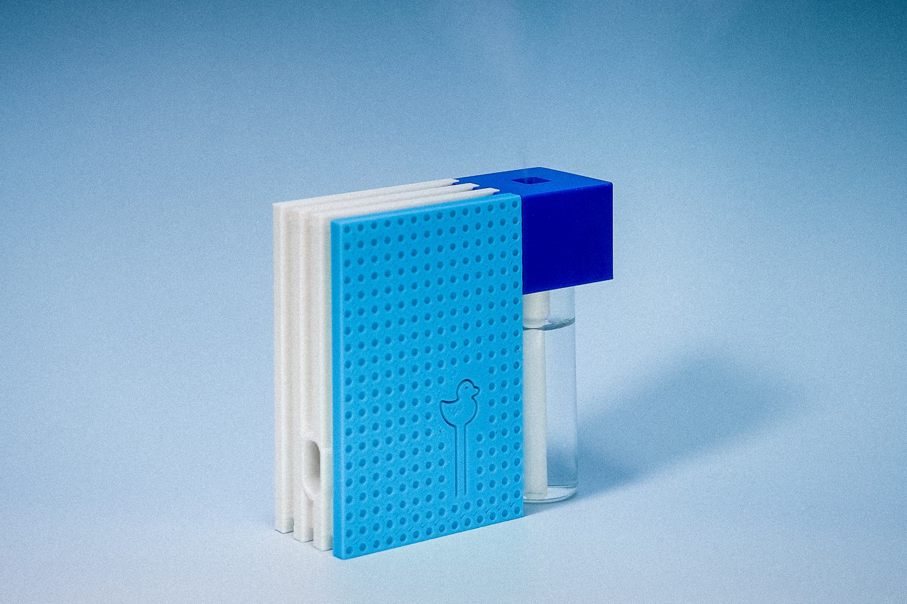

!!! note "Colors are just filament"
    These photos show two prints of the same parts — a yellow/orange set for the
    step-by-step below and a blue set for the studio shots. Nothing about the geometry
    differs.

## Parts

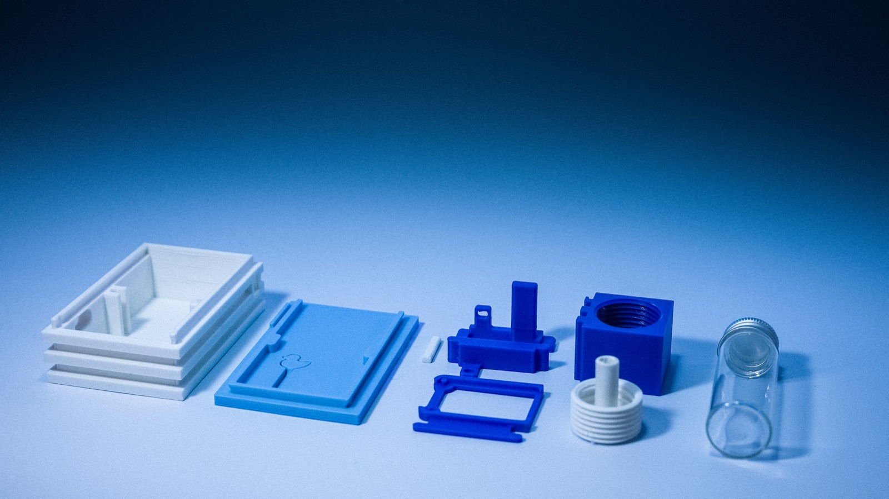

Printed parts, plus one bought one:

- **Frame** — the tray the board and the cell drop into.
- **Face plate** — closes the frame; the duck-on-a-stick outline is cut into it.
- **Board bracket** and **retainer ring** — hold the board and cell down in the frame.
- **Holder** — the threaded block that carries the disc. Its top face is the mist
  outlet; the glass vial threads onto the bottom.
- **Wick guide** — the threaded white plug with a tube through it. It seats against the
  back of the disc and channels the wick down into the vial.
- **Glass vial** — the reservoir, with a screw cap for when it's not in use.

Plus, from the kit itself: an assembled board, a XIAO ESP32-C6, a 1S Li-Po, a 16 mm
atomizing disc on a JST-PH lead, and a cotton stick.

!!! info "Print files"
    The STLs for these parts aren't published in the repo yet —
    [`variants/battery-kit/enclosure/`](https://github.com/Dav1dyang/Programmable-Mist-Maker/tree/main/variants/battery-kit/enclosure)
    is still a placeholder. Watch the repo, or
    [get in touch](../contact.md) if you want them sooner.

## Build it

1. **Lay out the parts.** Frame, holder, the disc on its JST lead, and the wick guide.

    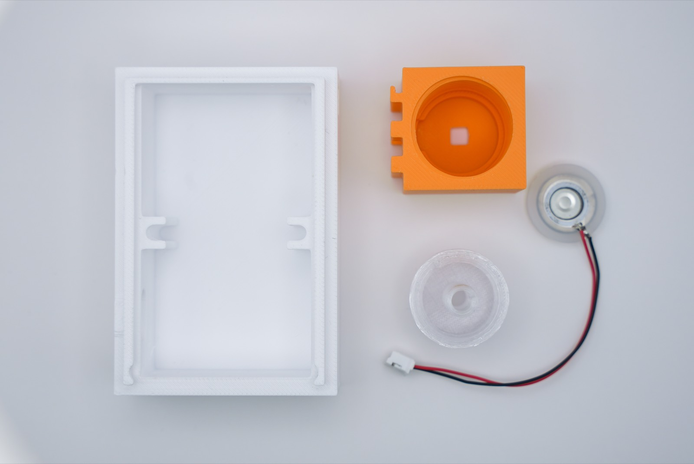

2. **Drop the disc into the holder.** The leads exit through the slot in the holder's
   side wall — route them before the disc is seated, not after.

    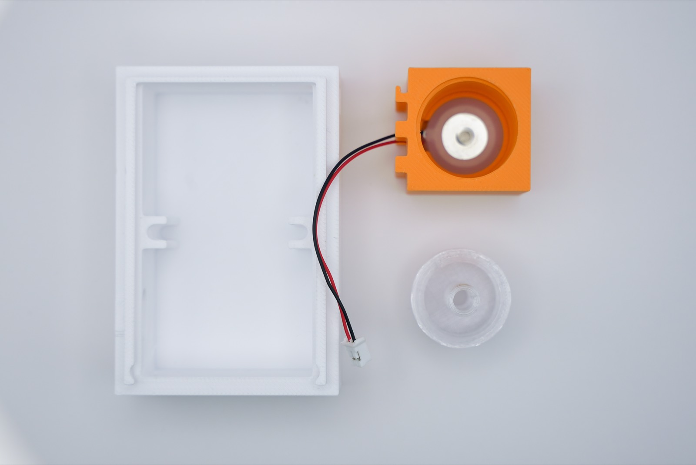

3. **Screw the wick guide in** behind the disc. It clamps the disc against the holder's
   outlet face and leaves a tube running out the back for the cotton stick.

    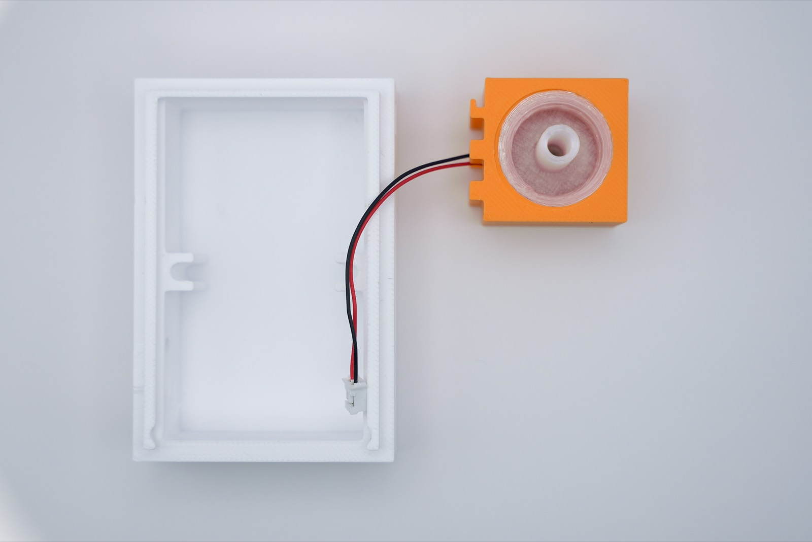

4. **Turn the holder over and route the lead** into the frame. The wick guide's tube
   now points down — that's the end the vial goes on. Bring the JST connector through
   to the middle of the frame, where the board's `DISC` connector will meet it.

    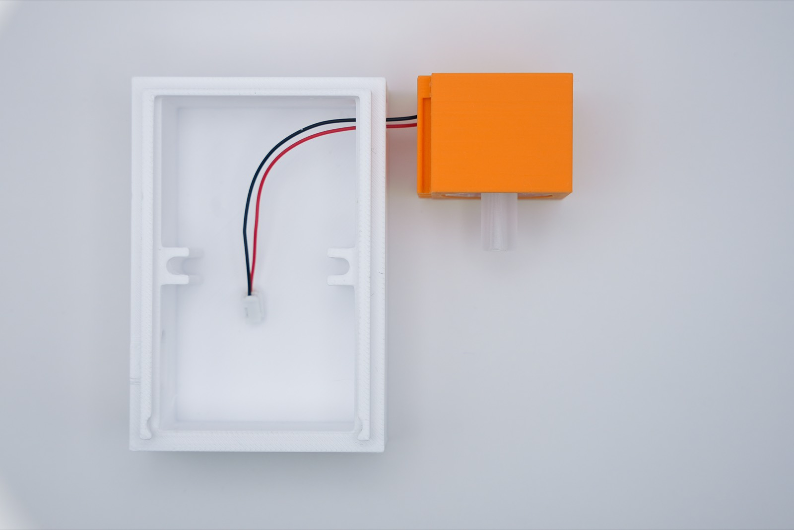

5. **Clip the holder onto the frame.** The holder's tabs engage the frame's right edge
   so the assembly stands as one piece.

    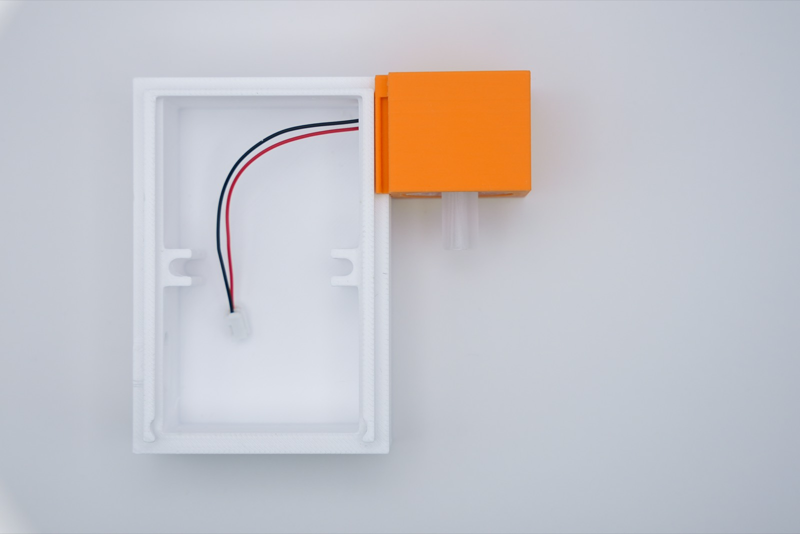

6. **Lower the board into the frame.** XIAO already seated, USB-C facing the frame's
   open edge so you can still plug in with everything assembled.

    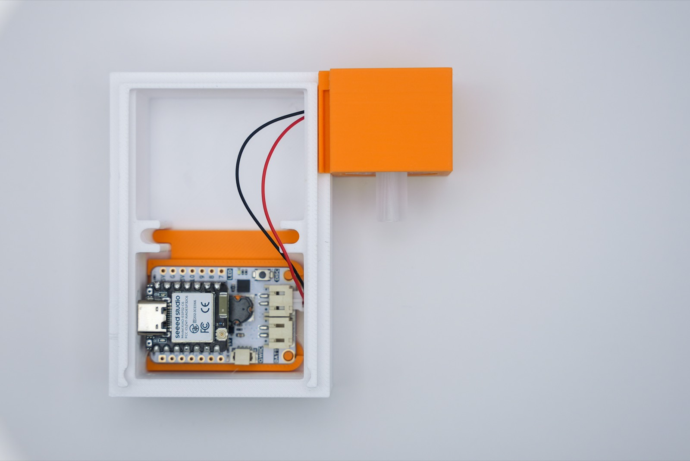

7. **Secure it with the board bracket** and connect the disc lead to `DISC`. Connect
   the cell to `BATT` at the same time — this is the last moment both connectors are
   easy to reach.

    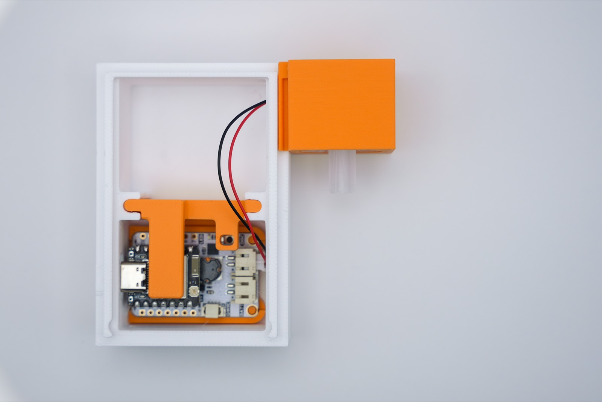

8. **Push a cotton stick down the wick guide** until it hangs into where the vial will
   sit. This is the whole water path: capillary action up the stick, onto the back of
   the disc, out the front as mist.

    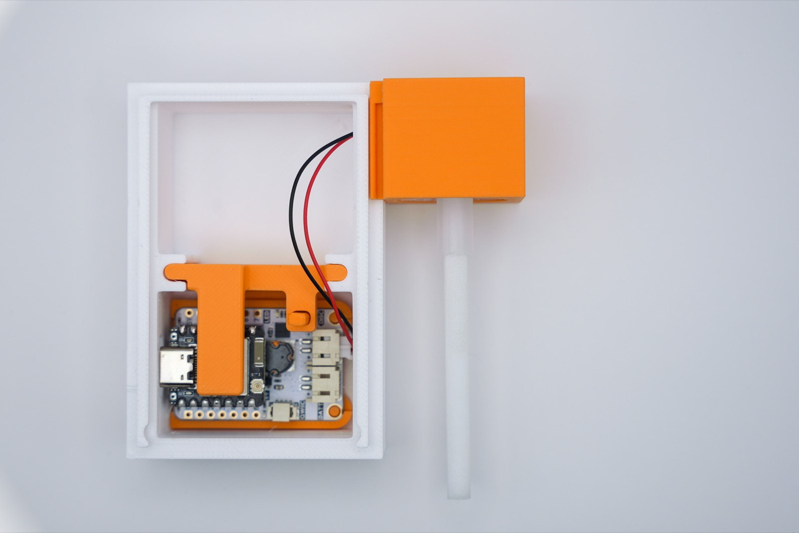

9. **Thread the glass vial on** over the wick. Fill it before you thread it on — with
   distilled or clean tap water, per the
   [care notes](../how-it-works.md#use-and-care).

    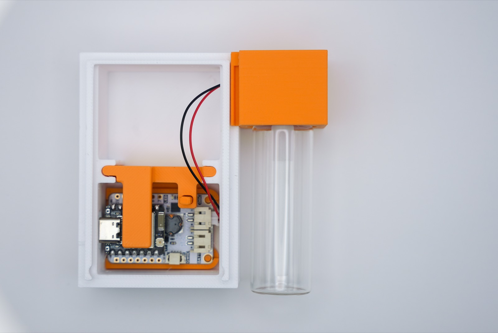

10. **Snap the face plate on.** It slides down the frame's rails until the tabs catch.

    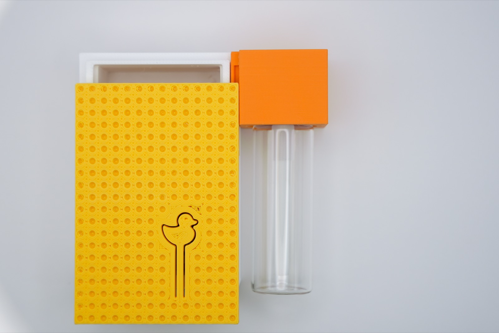

11. **Done.** Hold the button to run the
    [self-test](battery-kit.md#build-your-own), then flash something from the
    [MistMaker library](../library.md).

    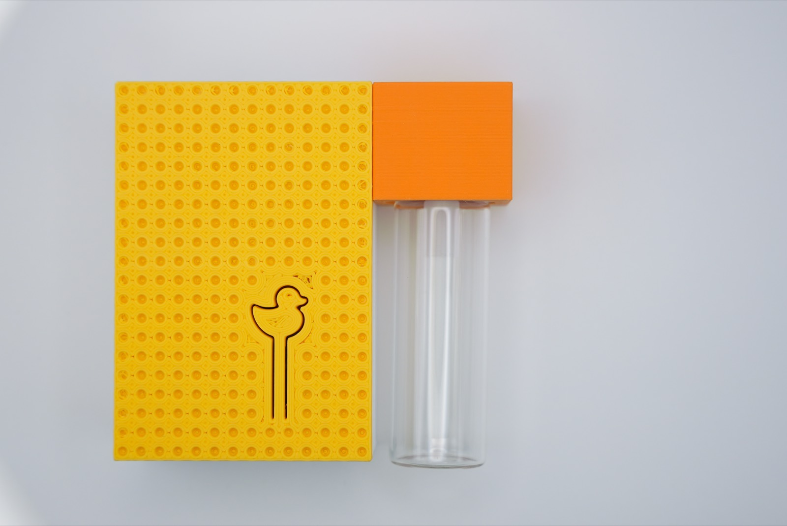

## Running it

Leave the face plate off while you're bringing a build up — you can watch the status
LED, reach the button, and still see whether the wick is actually wet. Everything in
[Use and care](../how-it-works.md#use-and-care) applies: let the wick dry between
sessions, and don't run the disc dry.
