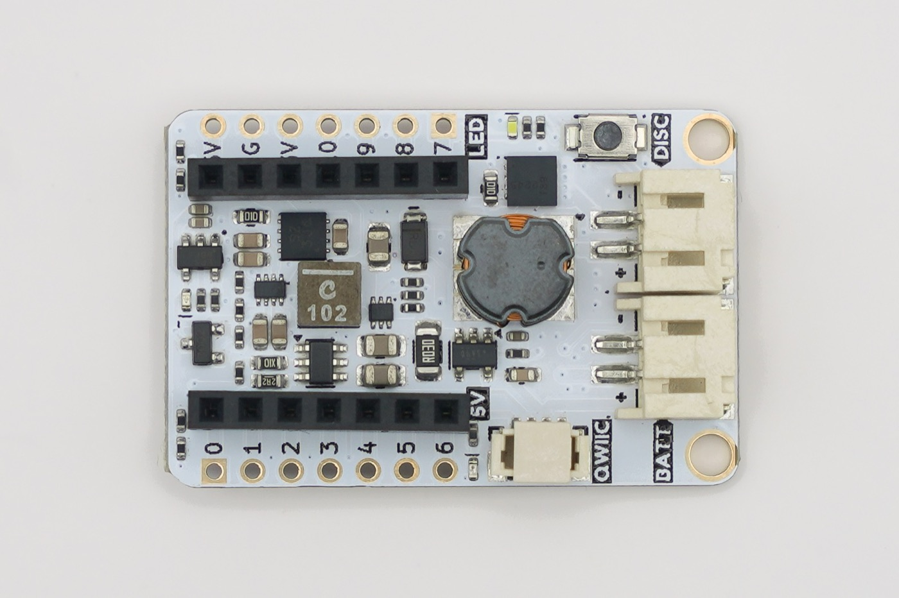
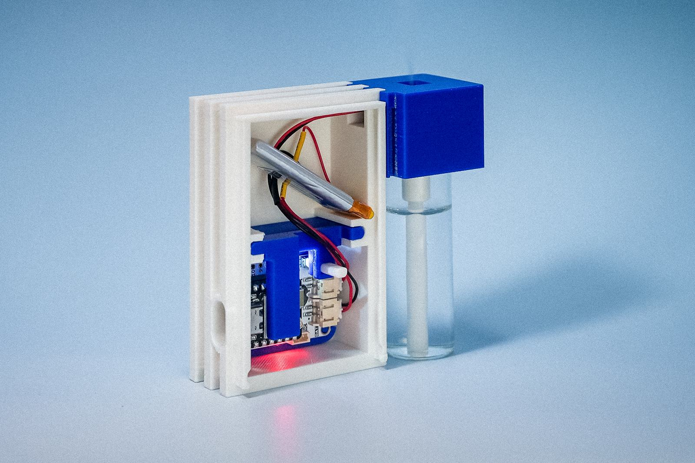

# How It Works

Every board in this project is the same idea with different power plumbing: an ESP32
shakes a piezo disc at its resonant frequency until water turns into mist. The
interesting part is *how* a 5 V USB rail ends up swinging tens of volts across a
ceramic disc — and why one strange little inductor makes it all work.


## The disc: atomization at 108.7 kHz

The mist disc isn't just a vibrating plate — it's a **micro-perforated atomizer**. The
center of the disc has microscopic holes; a cotton stick feeds water to the back side,
and as the piezo ceramic flexes at **108.7 kHz** (its mechanical resonance), each
oscillation pumps water through those holes, ejecting droplets fine enough to float as
a cool mist. No heat involved — the "steam" is room-temperature water.

This is why disc orientation matters (white ring faces up — mist exits there), why a
dirty or dry disc stops misting, and why running a disc dry can overheat it. Disc
behavior, droplet formation, and hole geometry are beautifully illustrated in the
[MDPI ultrasonic atomization study](https://www.mdpi.com/2076-3417/11/18/8350) that
informed this design.

## The resonant drive: 5 V in, ~80 Vpp out

A piezo disc is electrically a capacitor, and it wants far more voltage than a USB
port offers. Commercial humidifiers solve this with a clever resonant circuit, which
these boards adapt:

```
5V ──► gate driver ──► MOSFET ──► 3-leg tapped inductor ──► piezo disc (108.7 kHz)
        ▲ PWM from ESP32              (autotransformer + LC resonance)
5V current ──► 30 mΩ shunt ──► INA180A3 ──► ADC pin
```

1. The ESP32 outputs a **108.7 kHz PWM** (33% duty by default) into a gate driver + MOSFET.
2. The MOSFET rapidly switches the tapped inductor in a loop with the disc's own
   capacitance, forming an **LC tank** that rings at the drive frequency.
3. The inductor is *tapped* — three legs, roughly a **28 µH : 800 µH** winding ratio —
   so it doubles as an **autotransformer**, stepping the ringing voltage up to the
   ~80 Vpp the disc needs (measured on the Legacy V1.4 circuit — the production V0.x boards use the same drive topology).
4. Mist strength tracks how well the drive frequency matches the disc + inductor
   resonance — which is exactly why `setLevel()` (PWM duty) modulates mist like a
   dimmer.

    !!! info "Why the default is well under the maximum (measured 2026-07)"
        Longer on-time stores more energy in the inductor, but the resonant
        "ring-back" needs about half of each 9.2 µs cycle to swing — so past 50%
        duty the ring gets clipped and efficiency collapses. A full 0→90% duty
        sweep on V0.4 hardware found mist output actually **peaks near 70% duty**
        at ~4× the input power of the 50% point, then declines and turns unstable.
        The library defaults to a **33% cap** — bench-tested as a good amount of
        mist with the tapped inductor staying cool on long runs — and exposes the
        measured peak as `DUTY_TURBO`. Both are one call away; see the
        [library page](library.md#how-hard-can-it-drive-measured).
5. As a bonus, the current flowing through a 30 mΩ shunt (read by an INA180A3,
   3.0 V/A) differs measurably between *no disc*, *dry disc*, and *disc in water* —
   one ADC pin gives disc detection and a water sensor for free.

Stability details matter at these frequencies: the boards add RC snubbers, TVS
protection, and careful gate drive (the V0.x boards upgraded from a bare GPIO-driven
AO3400A to a dedicated UCC27511 gate driver for clean edges).

## The part you can't buy at DigiKey

The 3-legged tapped inductor is the soul of this circuit — and the hardest part to
source in the West. It doesn't meaningfully exist on DigiKey, Mouser, or Amazon, but
it's abundant and cheap on Taobao and AliExpress (search **“三腳電感”** — "three-leg
inductor"). It's a workhorse of Shenzhen-ecosystem designs: the same component that
makes commercial humidifiers compact is used to make **piezo buzzers in fire and smoke
alarms painfully loud** — same trick, voltage step-up by autotransformer + resonance
([good StackExchange teardown of exactly this part](https://electronics.stackexchange.com/questions/539843/how-does-the-component-alarm-boost-three-pin-inductor-make-a-piezo-buzzer-loud)).



*What it looks like in place: the round shielded can at the center of the Battery Kit,
a turn of copper just visible at its edge — the one part on these boards you can't
order from a Western distributor.*

!!! tip "Can't get the tapped inductor?"
    Misting works without it. A standard **680 µH inductor** in series with the disc
    forms an LC resonator with the piezo's built-in capacitance; drive it at
    ~113 kHz (changes based on the disc), add a 100 nF DC-blocking capacitor, power it up with ~30VDC and you get effective (if less
    efficient) mist. We verified this alternative experimentally — it trades the
    hard-to-source part for a slightly larger, simpler circuit.

## Design evolution


The project started by reverse-engineering cheap commercial humidifier circuits
(see [BigClive's teardown](https://www.youtube.com/watch?v=_TXlhOsPJyo) and [GreatScott's explainer](https://www.youtube.com/watch?v=OOZi3QnnDCo)), then rebuilding them as documented, hackable boards. The full design story is on [Hackster](https://www.hackster.io/dav1dyang/waste-into-wonder-making-programmable-mist-makers-fe3ae7).

**What we learned the hard way — and fixed in the current boards.** The Legacy V1.4 workshop board had classic quirks: serial connection inconsistent on battery, and uploads failing while misting. The Batt Kit V0.x boards design these problems away — the [Battery Kit](boards/battery-kit.md)'s **TPS2116 power mux** cleanly separates USB and battery paths (so programming just works, battery connected or not) and the piezo rail has its own dedicated boost converter. If you're reproducing the original board, the old fixes are preserved on the [Legacy V1.4 page](boards/legacy-v1-4.md#known-quirks-fixes).

## Use and care



*The arrangement every build repeats: electronics in the dry half, water in its own
vessel, and a cotton stick as the only thing that crosses between them.*

!!! warning
    Because the device uses a water reservoir and cotton sticks to move water near
    electronics, careless operation can lead to bacterial growth over time. Use
    distilled or clean tap water, clean the container regularly, and let cotton
    sticks dry fully between uses. Keep electronics dry where they should be dry.

- Never run the disc without water for long (it can overheat), and never drive the
  circuit without a disc attached (the MOSFET can overheat).
- Mist strength varies with water depth, disc cleanliness, and supply voltage.

## Research & references

The reading list that shaped this design — also linked throughout the
[original research notes](https://dav1dyang.notion.site/programmable-mist-maker):

**Science & circuit**

- [Ultrasonic atomization study (MDPI Applied Sciences)](https://www.mdpi.com/2076-3417/11/18/8350) — disc microstructure and droplet formation
- [Tapped "alarm boost" inductor explained (Electronics StackExchange)](https://electronics.stackexchange.com/questions/539843/how-does-the-component-alarm-boost-three-pin-inductor-make-a-piezo-buzzer-loud)
- [Mist maker circuit walkthrough (EDN)](https://www.edn.com/mist-maker/)

**Teardowns & tutorials**

- [GreatScott! — How ultrasonic humidifiers work](https://www.youtube.com/watch?v=OOZi3QnnDCo)
- [BigCliveDotCom — commercial mist maker teardown](https://www.youtube.com/watch?v=_TXlhOsPJyo)
- [Nick Electronics — how a humidifier works](https://www.youtube.com/watch?v=bngLvPxtoLA)

**Datasheets**

- [TPS61023 boost converter (TI)](https://www.ti.com/lit/ds/symlink/tps61023.pdf)
- [AO3400A MOSFET](https://mm.digikey.com/Volume0/opasdata/d220001/medias/docus/2587/UMW%20AO3400A.pdf) (legacy V1.4 switch; V0.x uses DMT10H009LCG + UCC27511)
