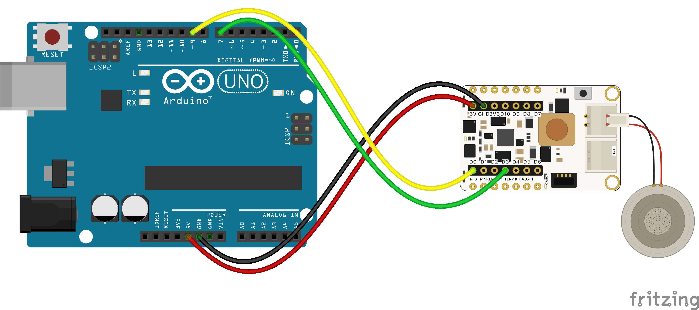
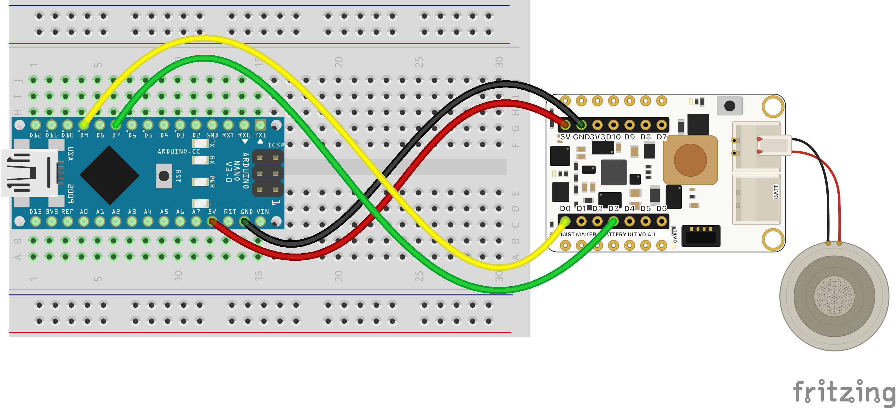
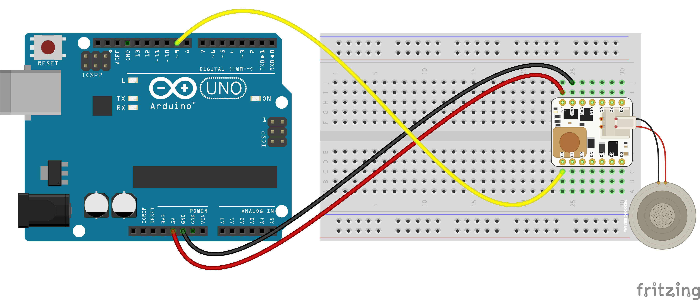
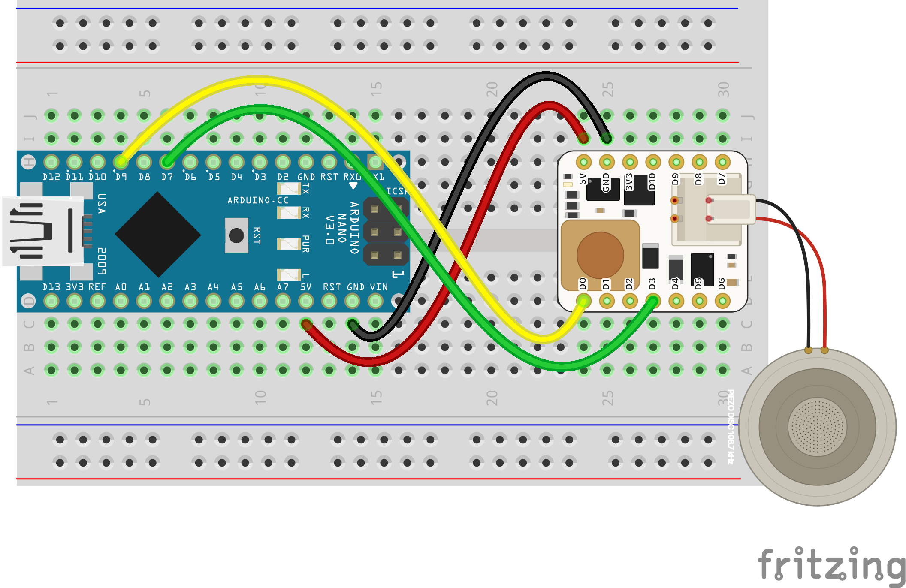

# Lab: Making Mist With an Arduino

## Introduction

In this lab you'll drive a Programmable Mist Maker from an Arduino Uno (R3
or R4), a Nano 33 IoT, or a Nano 33 BLE using nothing but jumper wires. Both
kits work: the **Battery Kit** normally carries a Seeed XIAO on its back, and
with the XIAO absent its socket is a perfect jumper-wire header; the
**Extension Kit** works the same way once you solder a row of 2.54 mm headers
onto its XIAO footprint.

By the end you'll have mist puffing on a timer, and you'll know why a mist
maker needs a very particular kind of pin to work at all.

### What You'll Need to Know

- [Digital input and output](https://itp.nyu.edu/physcomp/labs/labs-arduino-digital-and-analog/digital-input-and-output-with-an-arduino/)
- [Analog input](https://itp.nyu.edu/physcomp/labs/labs-arduino-digital-and-analog/analog-in-with-an-arduino/)
- What [PWM](https://itp.nyu.edu/physcomp/labs/labs-arduino-digital-and-analog/analog-out-with-an-arduino/) is

### Things You'll Need

- A Mist Maker kit with its piezo disc:
    - **Battery Kit** (V0.4.1) with **no XIAO installed** — jumper-ready, and
      the kit this guide walks through, or
    - **Extension Kit** (V0.1) with 2.54 mm headers soldered to the XIAO
      footprint — see [Using the Extension Kit](#using-the-extension-kit)
- An Arduino Uno R3, Uno R4 (Minima or WiFi), Nano 33 IoT, or Nano 33 BLE
- 4–10 male-to-male jumper wires
- A USB cable to your laptop (a laptop port is fine at the default mist
  level), or a USB wall charger
- A small container of water for the disc
- Arduino IDE with the **MistMaker** library v2.5.0 or newer (Library
  Manager → "MistMaker")

## Why 108.7 kHz?

The piezo disc atomizes water only when driven at its mechanical resonance,
about 108.7 kHz. The kit has the power electronics on board — a gate driver
and MOSFET that turn a small logic signal into a strong drive — but the
timing signal comes from your Arduino.

Here's the catch: `analogWrite()` runs at about 490 Hz. That's 200× too slow —
the disc just sits there. Making 108.7 kHz takes a hardware timer, and on most
Arduinos only a few pins are attached to a timer that can do it. The MistMaker
library programs that timer for you, which is why it asks for specific pins:

| Board | Pins that can make mist |
|---|---|
| Uno R3 | 9, 10 |
| Nano 33 IoT | 5, 6, **9**, 10, 11 |
| Uno R4 | 3, 5, 6, **9**, 10, 11 |
| Nano 33 BLE | any digital pin (**9** recommended) |

Pin **9** works on every one of these boards, so this guide wires everything
the same way no matter which Arduino you have. If you pick a pin that can't
do it, the library stops you: `MISTMAKER_ASSERT_MIST_PIN` fails the compile
with the valid pins in the message, and `begin()` returns false at runtime
with the same hint on the Serial Monitor.

## Wire It Up (Battery Kit, USB Mode)

Unplug everything first. Find the kit's empty XIAO socket — two rows of seven
holes, labeled on the silkscreen. Four wires make mist:

- Connect **Arduino 5V** to the kit's **5V pad** (red wire) — powers the kit.
- Connect **Arduino GND** to the kit's **GND pad** (black wire) — shared ground.
- Connect **Arduino 9** to the kit's **D0 pad** (yellow wire) — the 108.7 kHz
  mist signal.
- Connect **Arduino 7** to the kit's **D3 pad** (green wire) — boost enable;
  the kit's ~5 V drive rail stays OFF until this pin goes HIGH.



_Figure 1. Uno wired to the Battery Kit. The Uno's headers take jumper ends
directly, so no breadboard is needed. A red wire runs from the Uno's 5V pin
to the kit's 5V pad and a black wire from GND to the kit's GND pad — both on
the kit's top row. A yellow wire runs from pin 9 to the kit's D0 pad and a
green wire from pin 7 to its D3 pad, both on the bottom row. The piezo disc's
red-and-black cable plugs into the kit's DISC connector on the right._

<!-- photo slot: staged photo of the real Uno + Battery Kit wiring -->
_A real build of this wiring._



_Figure 2. Nano wired to the Battery Kit — a classic Nano is pictured
(Fritzing has no Nano 33 IoT part), but the 33 IoT and BLE use the same
positions for all four pins. The Nano straddles the breadboard's center
divide at the left end, USB pointing left; the kit sits beside the
breadboard. Yellow runs from the row beside D9 to the kit's D0 pad, green
from D7 to D3, red from the Nano's 5V to the kit's 5V, and black from GND to
GND. The disc plugs into the DISC connector on the right._

### Note on Power

At the default mist level the whole rig draws about 0.3 A — **a laptop USB
port handles that fine**. If you push the mist level up with
`setMaxDuty()` (the turbo setting quadruples the power), switch to a USB
wall charger or the Uno's barrel jack: near peak drive the current can sag a
weak port until the board resets.

### Note on Heat

The kit works hard when it mists, and **getting warm is normal**. The
inductor — the chunky component near the piezo connector — gets genuinely
**hot** during long runs and hotter at higher mist levels. Don't touch it
while misting or right after, and give the board airflow rather than boxing
it in.

### Note on the Nano's 5V Pin

Out of the box the Nano 33 IoT's and Nano 33 BLE's 5V pin is **not
connected** — Arduino ships them that way to protect 3.3 V projects. On the
back of the board, find the solder jumper labeled **VUSB** and bridge it with
a blob of solder. After that the 5V pin carries USB voltage and wire 1 works.
(Uno R3 and R4 need no such step.)

## Program It

Open **File → Examples → MistMaker → JumperWireQuickStart**. The whole sketch
is short. First the pin choices, with the compile-time guard:

```cpp
#include <MistMaker.h>

const int MIST_PIN = 9;  // must sit on a fast timer — the check below explains
MISTMAKER_ASSERT_MIST_PIN(MIST_PIN);

const int BOOST_ENABLE_PIN = 7;

MistMaker mist(MIST_PIN, BOOST_ENABLE_PIN, -1, -1);
```

The two `-1`s mean "no current-sense pin, no LED pin" — you haven't wired
those yet. In `setup()`, start the library and stop if the pin was wrong:

```cpp
void setup() {
  Serial.begin(115200);
  if (!mist.begin()) {
    while (true) {}  // wrong mist pin — the Serial message names the good ones
  }
}
```

The loop is the mist version of Blink:

```cpp
void loop() {
  mist.turnOn();
  delay(6000);
  mist.turnOff();
  delay(3000);
}
```

Pick your board in **Tools → Board**, upload, and set the disc in its water
container. Within a few seconds: six seconds of mist, three seconds of rest,
repeating. That's all it takes.

Try `mist.setLevel(80)` in place of `turnOn()` — mist dims like an LED, 0 to
255.

## My Mist Won't Start!

**Nothing happens at all.** Check the disc is seated in water — a dry disc
makes no visible mist. On the Battery Kit, check wire 4 (pin 7 → D3): the
kit's drive rail boots OFF and stays off until the sketch raises that pin.

**The Arduino resets every time mist starts.** The power source is sagging —
usually a raised mist level, a worn cable, or a weak hub port. Try the
default level first; for higher levels use a wall charger or the barrel
jack.

**The compiler stopped with a message about the mist pin.** Good — that's the
library catching a pin that can't make 108.7 kHz. Move the mist wire and the
`MIST_PIN` constant to a pin from the table above.

**Mist worked, then got weak and erratic.** Two usual suspects. First, the
water level — the disc needs water contact, and running low is exactly what
the water-detection variation below is for. Second, the wick's fit: it needs
to sit **right on the disc, just touching**. Too far away and the disc loses
its water supply; pressed too tight and the wick damps the piezo's vibration.
Either way the mist weakens — reseat the wick so it rests against the disc
without squeezing it.

If water and wick check out and the mist is still dim, **swap in a fresh
piezo disc**. Discs wear out — and in particular, a disc that runs for long
stretches **without water can be permanently damaged** and never mist well
again. (That's the practical reason for the water-detection variation below:
it stops the drive before a dry run hurts the disc.)

**Current reads 0 mA / WaterDetect says "no disc found" with a disc right
there.** The kit's sense amplifier has no power. In USB mode it's fed by the
orange 3.3V wire (Arduino 3.3V → kit 3V3 pad) — without it every current
reading is zero. Add the wire; on battery mode the kit powers the amplifier
itself.

## Variation: Run on Battery

The Battery Kit powers itself from its own cell — then the Arduino only
supplies signals. Wiring drops to three wires:

- Connect **Arduino GND** to the kit's **GND pad** (black wire).
- Connect **Arduino 9** to the kit's **D0 pad** (yellow wire).
- Connect **Arduino 7** to the kit's **D3 pad** (green wire).

Remove the red 5V wire, and if you added the 3.3V wire from the
water-detection variation, remove that too (on battery the kit drives its
own 3.3 V rail).

## Variation: Water Detection

The kit measures the disc's current draw, and from it can tell a disc in
water from a dry disc from no disc at all. Two more wires:

- Connect **Arduino 3.3V** to the kit's **3V3 pad** (orange wire) — powers the
  kit's sense amplifier (USB mode only; remove on battery power).
- Connect **Arduino A1** to the kit's **D2 pad** (blue wire) — the
  current-sense signal.

Change the constructor's first `-1` to `A1`, or use the full preset (below).
Then run the **WaterDetect** example: it probes the disc in every off-window,
stops when the water runs out, and resumes when you refill. Run
`autoCalibrateSense()` once (send `'c'` in the Serial Monitor) — your
Arduino's ADC differs a little from the board the default thresholds were
measured on.

## Variation: Everything Wired

For battery readouts, USB-vs-battery detection, the kit's button and LED, add
the remaining wires and use the preset — it's the same map on all the boards:

```cpp
MistMaker mist(MistMakerBatteryKitV041());
// kit D0->9  D3->7  D6->2  D7->4  D1->A0  D2->A1  D8->A2
```

With A0 and A2 wired, the **BatteryPowerTest** example reports the power
source, battery voltage, and charge state live.

## Using the Extension Kit

The Extension Kit rides the breadboard. It ships with bare through-hole
pads on its XIAO footprint — solder in **male 2.54 mm header pins** and it
mounts straddling the breadboard's center divide, exactly like a Nano (its
two pin columns are the same 0.6 in apart). It has no battery and no boost
enable (its drive rail is live whenever powered), so three wires make mist:

- Connect **Arduino 5V** to the breadboard row beside the kit's **5V pin**
  (red wire) — powers the drive rail directly.
- Connect **Arduino GND** to the breadboard row beside the kit's **GND pin**
  (black wire) — shared ground.
- Connect **Arduino 9** to the breadboard row beside the kit's **D0 pin**
  (yellow wire) — the 108.7 kHz mist signal.



_Figure 3. Uno wired to the Extension Kit. The kit, soldered to male header
pins, mounts on the breadboard straddling the center divide. A red wire runs
from the Uno's 5V to the breadboard row beside the kit's 5V pin, a black wire
from GND to the row beside GND, and a yellow wire from pin 9 to the row
beside D0. No enable wire — the drive rail is live whenever power arrives.
The disc plugs into the kit's piezo connector on the right._



_Figure 4. Nano wired to the Extension Kit — both boards share one
breadboard, each straddling the center divide. Yellow runs from the row
beside the Nano's D9 to the row beside the kit's D0, red from 5V to 5V, and
black from GND to GND. (A green wire from D7 to the kit's D3 is also
pictured; the Extension Kit has no boost to enable, so it does nothing here —
three wires are all this kit needs.)_

In code, use the Extension preset (or pass `-1` for the enable pin):

```cpp
MistMaker mist(MistMakerExtensionV01());
```

Water detection works here too: orange 3.3V → 3V3 pad, blue A1 → D2 pad.
The same power and heat notes apply.

## The Uno vs the Nano 33 IoT vs the Uno R4 vs the Nano 33 BLE

- **Logic levels.** The Uno R3 and R4 are 5 V boards; the Nano 33 IoT and
  BLE are 3.3 V. The kit accepts both on its inputs, so the same wiring
  works — but never wire the kit's 5V-in to a Nano output pin.
- **Mist resolution.** The mist signal has 147 brightness steps on the R3
  and BLE, and 442 on the Nano 33 IoT and R4 (their timers run faster).
  You'll only notice in slow fades at the dimmest levels.
- **Timer sharing.** On the R3, the mist borrows Timer1: the `Servo` library
  and `analogWrite()` on pins 9/10 would break the mist. On the Nano 33 IoT,
  avoid `analogWrite()` on pins 5, 6, 10, A2, A3 while misting; pins 4 and 7
  still dim LEDs fine. On the R4 and the BLE there's no conflict at all.
- **Uploading.** The Nanos and R4 have native USB — the port can vanish and
  reappear during upload; that's normal.

## Get Creative

Mist responds to anything a sensor can measure. Breathe on a stretch sensor
and have the mist breathe back (`Breath` example). Put mist on a doorway
with a distance sensor. Cross two misting doorways. The `setLevel()` scale
makes mist a dimmable material, like light — what does a *gesture* of mist
look like?

---

*This guide follows the format of the
[ITP Physical Computing labs](https://itp.nyu.edu/physcomp/labs/). Library:
[MistMaker](https://github.com/owochel/MistMaker) v2.5.0+. Hardware:
OSHWA US002742.*
