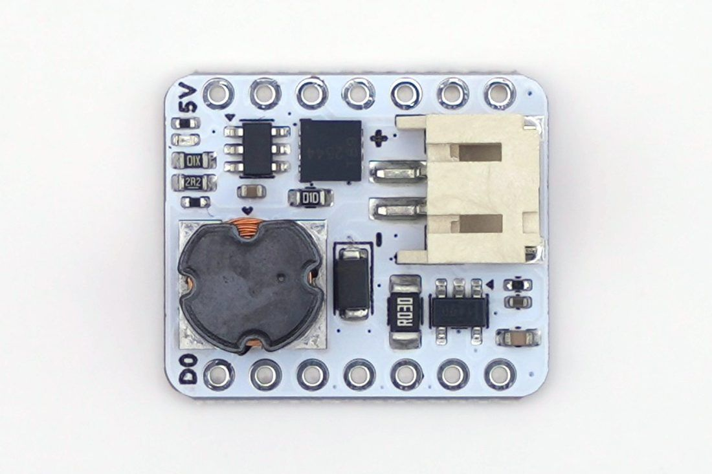

# Xiao Extension Kit — V0.1

The simplest way to drive mist from a [Seeed XIAO ESP32-C6](https://www.seeedstudio.com/Seeed-Studio-XIAO-ESP32C6-Pre-Soldered-p-6328.html): an expansion PCB that mounts directly on the XIAO. USB-C powered, no battery, no boost converter — just the piezo drive stage and an INA180 current-sense amp so your code can *feel* the disc working.

Great for: desks, breadboard experiments, classrooms, and anyone's first mist build.

📖 **[Full guide with interactive schematic](https://docs.byproductlab.com/boards/extension-kit/)** ·
🛒 **[Buy it assembled](https://shop.byproductlab.com/kits/extension-kit)**



## What's in this folder

| Subfolder | Contents |
|---|---|
| [`hardware/`](hardware/) | KiCad project, schematic/assembly PDFs, BOM, JLCPCB production files |
| [`firmware/ExtensionKit_BringUp/`](firmware/ExtensionKit_BringUp/) | Per-feature test sketch — flash this first on a new board |
| `enclosure/` | 3D-printable demo enclosure (not published yet) |

## How it works

```
XIAO USB-C 5V ──┬─► UCC27511 gate driver ─► DMT10H009 MOSFET ─► 3-leg inductor ─► piezo disc
                │         ▲ D0: 108.7 kHz PWM                     (LC resonance boosts
                └─► 30 mΩ shunt ─► INA180A3 ─► D2 (analog)          5 V to ~80 Vpp)
```

- The ESP32 outputs a **108.7 kHz PWM** (the disc's resonant frequency) at 33% duty by default — the thermal sweet spot, not a hard ceiling ([why](https://docs.byproductlab.com/how-it-works/#the-resonant-drive-5-v-in-80-vpp-out)).
- The MOSFET switches the tapped-inductor + piezo loop; LC resonance boosts the 5 V rail to the ~80 Vpp the disc needs (measured on the Legacy V1.4 circuit; same topology here).
- The **INA180A3** (100 V/V) reads the voltage across a 30 mΩ shunt — 3.0 V per amp into D2. A dry disc draws visibly less than a wet one, which is how disc-presence and water-level detection work.

## Pin map

| XIAO pin | Net | Function |
|---|---|---|
| D0 | `MIST_PWM_3V3` | 108.7 kHz PWM to gate driver |
| D2 | `CS` | INA180A3 current-sense output (3.0 V/A) |
| D4 / D5 | SDA / SCL | I2C breakout — free for your sensors |

## Key components ([full BOM](hardware/production/bom.csv))

| Part | Role |
|---|---|
| UCC27511A gate driver | Clean, fast MOSFET gate edges at 108.7 kHz |
| DMT10H009LCG MOSFET | Switches the resonant loop |
| 3-legged tapped inductor (CD75) | LC voltage boost to ~80 Vpp |
| INA180A3 + 30 mΩ shunt | Analog current sense (3.0 V/A) |
| PH-2.0 connector | Piezo disc |

## Build your own

1. Order PCBs with the JLCPCB production files in [`hardware/`](hardware/) (SMT assembly recommended — everything except the connectors can be machine-placed).
2. Solder the PH-2.0 piezo connector and XIAO headers.
3. Mount a XIAO ESP32-C6.
4. Flash [`firmware/ExtensionKit_BringUp/`](firmware/ExtensionKit_BringUp/) and walk its serial checklist (`h` for help).
5. Install the [MistMaker library](https://github.com/owochel/MistMaker) (v2.2+) and try the examples: `Blink` → `Breath` → `WaterDetect` → `PhoneDemo`.

In library examples select the board with:

```cpp
MistMaker mist(MistMakerExtensionV01());
```

## Notes

- Power budget: a misting disc draws roughly 0.3–0.5 A from the 5 V USB rail — any normal USB port or charger is fine.
- Safety, cleaning, and known-issues notes live in the [root README](../../README.md).
